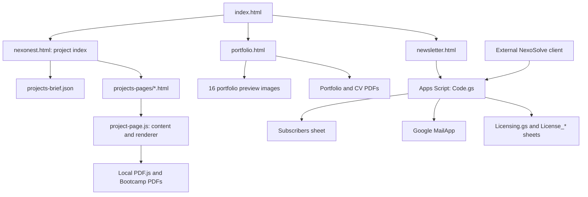

# NexoNest - Architecture and Developer Handoff

This is the canonical guide to **this website repository**, not an implementation
guide to all the products it presents. Rhino plugins, simulation engines and
desktop clients described on the site generally live in other repositories.

Scope: all public pages, frontend modules, styles, data, media, local PDF viewer,
newsletter and licensing service sources, publishing configuration, legacy code,
known limitations, and contributor procedures. The generated appendices record
the exact source snapshot and every public project section.

**Evidence labels used here:**

- **Fact:** observed in the current checkout or an explicitly identified source.
- **Recorded decision:** supported by comments, existing documentation or the
  development conversation. It does not imply production verification.
- **Inferred rationale:** a technical interpretation of the implementation; the
  original author did not necessarily state this reason.
- **Recommendation:** a proposed future improvement, not current behavior.

Current working-tree changes are included. In particular, the Apps Script
licensing integration is present locally but was uncommitted at this review.
Remote settings, deployed versions, email delivery and external product maturity
have not been independently verified by this documentation pass.

## Contents

1. [Purpose and system boundary](#purpose-and-system-boundary)
2. [Repository layout](#repository-layout)
3. [Public pages and entry points](#public-pages-and-entry-points)
4. [Runtime and dependency model](#runtime-and-dependency-model)
5. [Project index](#project-index)
6. [Editorial project pages](#editorial-project-pages)
7. [Bootcamp documents and video](#bootcamp-documents-and-video)
8. [Portfolio and journey](#portfolio-and-journey)
9. [Newsletter frontend](#newsletter-frontend)
10. [Newsletter backend](#newsletter-backend)
11. [Licensing service](#licensing-service)
12. [Styles and shared UX](#styles-and-shared-ux)
13. [Assets and external services](#assets-and-external-services)
14. [SEO and hosting](#seo-and-hosting)
15. [Legacy and disconnected components](#legacy-and-disconnected-components)
16. [Decision register](#decision-register)
17. [Known risks and technical debt](#known-risks-and-technical-debt)
18. [Development and change recipes](#development-and-change-recipes)
19. [Verification and release](#verification-and-release)
20. [Documentation maintenance](#documentation-maintenance)
21. [Generated reference](#generated-reference)

## Purpose and system boundary

The website communicates a computational design and research practice: project
briefs, product pages, research evidence, education archives and a personal
academic portfolio. It is primarily a publishing application, not a cloud
simulation platform, plugin runtime, LMS or payment service.

The browser serves HTML/CSS/JavaScript and repository assets. The optional backend
is a separate Google Apps Script web app backed by Google Sheets and MailApp.
The locally present licensing API serves the external NexoSolve desktop product;
there is no website login UI or browser license client in this repository.



No part of the diagram implies a currently deployed or functioning remote
service. Read the relevant implementation and deployment status separately.

## Repository layout

| Location | Responsibility |
| --- | --- |
| Root HTML | Home, project index, portfolio, newsletter, CurvAdapt wiki, old template |
| `projects-pages/` | Sixteen small project page shells; titles, metadata, body project ID |
| `licenses/` | Public NexoRhino software terms; separate from NexoSolve activation |
| `js/` | Shared UI, project index, editorial renderer, portfolio and old renderer |
| `css/` | Design tokens, reset/base, shared layout/components and page styles |
| `data/projects-brief.json` | Category taxonomy and short project index records |
| `data/projects-jsons/` | Two legacy rich project JSON records |
| `assets/icons/` | Product/project marks |
| `assets/images/` | Evidence figures, screenshots, team photos, certificates, portfolio previews |
| `assets/documents/` | Branded CV/portfolio and Bootcamp source/preview PDFs |
| `assets/videos/bootcamp/` | Local archived participant videos; not all used by current page |
| `assets/vendor/pdfjs/` | Pinned library, matching worker, Apache license and version note |
| `files/` | Academic portfolio and CV downloads currently linked by portfolio page |
| `integrations/google-apps-script/` | Deployment sources and backend operational documentation |
| `scripts/` | Documentation snapshot maintenance; no frontend build system |
| `tmp/` | Ignored scratch/verification artifacts; not a release or test contract |
| `tmp-gp8-extract/` | Extraction residue outside the ignored `tmp/`; not a public feature |
| `.idea/` | Ignored editor state |
| `CNAME`, `robots.txt`, `sitemap.xml` | Domain/crawler configuration |
| `README.md`, `AGENTS.md`, this guide | Entry point, contributor rules, full handoff |
| `README.txt` | Original one-line readme; not the full handoff |

The generated file inventory lists exact files. Hidden Git/editor internals and
scratch directories are excluded from the maintained application snapshot.

## Public pages and entry points

| Page | Runtime and content owner | Important boundary |
| --- | --- | --- |
| [Home](index.html) | Static HTML, `home.css`, shared `ux.js` | Personal overview and navigation; inline Person structured data |
| [Project index](nexonest.html) | Six index modules and brief JSON | Filters and project popup, then real page navigation |
| [Portfolio](portfolio.html) | HTML plus `portfolio.js`, deferred `journey.js` | Independent personal content; not populated from brief JSON |
| [Newsletter](newsletter.html) | HTML form plus `newsletter.js` | Makes real backend submissions if used normally |
| [CurvAdapt wiki](curvadapt-wiki.html) | Static HTML and dedicated CSS | A planned learning path, not a complete generated documentation portal |
| [NexoRhino terms](licenses/nexorhino.html) | Static legal content and project navigation | Proprietary terms/attribution; not the licensing API |
| [Old template](project-template.html) | Static sample content and project navigation | Demonstrates old content blocks; not the active shell generator |
| `projects-pages/*.html` | `body[data-project]` selects `PROJECT_PAGE_DATA` | Full mapping and sections in generated reference |

All current editorial project shells load `project-page.js`,
`project-navigation.js`, and `ux.js`. NexoRhino also loads `nexorhino.css`.
Do not infer that `design-suite.css` is active merely because its file exists.

## Runtime and dependency model

**Fact:** there is no frontend `package.json`, bundler, framework, server-side
rendering pipeline, database migration system or checked-in deployment workflow
in the reviewed checkout. JavaScript mostly uses classic scripts, IIFEs and
globals; PDF.js is dynamically imported as an ES module.

Serve the repository over HTTP rather than opening `file://` URLs: JSON requests,
module imports and workers depend on normal browser origin behavior. A local
server needs to send JavaScript MIME types for `.mjs`. Partial PDF loading also
depends on the server honoring byte range requests.

Script order is an application contract. The index loads:

```text
filter.js -> state.js -> data.js -> nav.js -> modal.js -> render.js
                                                     + deferred ux.js
```

Definitions are established in this order; DOMContentLoaded handlers then load
data and bind/render UI. Moving these scripts to `async` can break their globals.
The shared loader deduplicates requests only within one page's lifetime, not
across navigation to another page.

External runtime resources include Google Fonts, unpinned Lucide on the
portfolio, YouTube embeds and the configured Apps Script newsletter endpoint.
The Bootcamp PDF viewer uses local vendored files. Product repositories,
food4Rhino listings and social links are outgoing destinations, not backend
implementations in this checkout.

## Project index

Sources: [brief data](data/projects-brief.json), [data loader](js/data.js),
[filters](js/filter.js), [state](js/state.js), [navigation](js/nav.js),
[popup](js/modal.js), [rendering](js/render.js).

### Data contract

Top-level arrays are `categories`, `subcategories`, and `projects`.
Category fields are `id`, `label`; subcategories add `parent`, which references a
category ID. Project fields are `id`, `title`, `excerpt`, `url`, `icon`, `image`,
`categories[]`, and `subcategories[]`. IDs in this index normally start with
`p_`; they are distinct from editorial IDs such as `abm-bootcamp`.

Category IDs are `education`, `projects`, `products`, `events`, `publications`.
One project can belong to several categories/subcategories. A subcategory's
`parent` controls which filter group displays it.

`loadProjectsData()` fetches JSON using `cache: 'no-store'`, caches its promise and
stores the result as `window.projectsData`. Failure is logged and resolves to an
empty data object. It does not retry automatically during that page lifetime.

### Interaction and ownership

1. `render.js` builds button icons using a fixed visual ordering, with alphabetical
   fallback for projects absent from that order. Text initials replace missing
   icons. Six decorative future-project placeholders follow the real projects.
2. `state.js` owns `activeCategory`, `activeSubcategory`, `activeProject` and
   exports state setters. UI updates rebuild subfilter chips, apply filters and
   update pressed/active states. `activeProject` is a state field; the popup also
   maintains its own current project.
3. `filter.js` normalizes labels/IDs and singular/plural aliases. Subcategory
   selection takes precedence over category selection. Nonmatches are dimmed,
   marked aria-disabled and removed from keyboard tab order, rather than deleted.
4. `nav.js` delegates clicks. A category click clears the subcategory; selecting a
   subcategory selects its parent category. Empty-space clicks clear filters.
   Project clicks request the popup. Circle navigation has an 850 ms animation.
5. `modal.js` owns popup visibility, scroll locking, fallback imagery, SVG logo
   fitting, focus placement/return, Escape handling and Tab focus wrapping.
   Opening the selected project's URL uses a full page navigation.

**Inferred rationale:** a shared JSON catalogue avoids duplicating filter
taxonomy in every index module, while keeping editing possible without a build.
The fixed shuffle is explicitly intended to keep a playful composition stable
between visits. This is a small catalogue, so repeated linear lookups are simple;
they would become inefficient for a much larger catalogue.

## Editorial project pages

Sources: [renderer and content](js/project-page.js),
[navigation](js/project-navigation.js), [styles](css/project.css).

### Content contract

`PROJECT_PAGE_DATA` is the active rich-content source. `PROJECT_PAGE_ORDER` is the
previous/next navigation order; the printed `page` label is a separate field.
Each HTML shell's `data-project` must match a key in the object.

Shared fields include `page`, `title`, `shortTitle`, `subtitle`, `icon`, `iconAlt`,
`eyebrow`, `lead`, `role`, `period`, `status`, `stack`, `tags`, `question`,
`response`, `proof`, `sections`, and optional `links` and `navGroups`. The active renderer escapes
visible editorial strings with `escapeHtml`; URLs still come from repository data.
This is source-authored content, not a validated arbitrary user-content CMS.

`renderProjectPage()` sets the title, English language, description and Open Graph
metadata; appends CreativeWork JSON-LD; populates the hero/sidebar/content/footer;
binds document/video controls; and dispatches `project:rendered`. Canonical/page
URLs also exist in HTML shells and hard-coded renderer mappings.

### Supported section kinds

| `kind` | Required content shape | Result |
| --- | --- | --- |
| `split` | `text[]`, `aside {label,text}` | Prose and margin note |
| `cards` | `items: [title,text][]` | Parallel feature/finding cards |
| `steps` | `items: [number,title,text][]` | Numbered workflow |
| `table` | `headers[]`, `rows[][]`, optional `note` | Data/programme table with an optional explanatory note |
| `columns` | `columns: {title,items:[title,items[]][]}[]` | Grouped curriculum |
| `projects` | `items: {code,title,people,pdf?,previewPdf?,video?}[]` | Bootcamp project selector/viewer |
| `archive` | `items: {code,title,status,description,href}[]` | Education archive links |
| `figure` | `image`, `alt`, `caption` | Evidence image |
| `figure-text` | Figure fields plus `text` | Evidence with explanation |
| `honesty` | `label`, `text` | Scope/maturity limitation |
| `credits` | `text`, optional `links`, optional `groups` | Attribution/links; groups contain `label` and `[name,role][]` people |

Every section also has `title`. Unknown kinds currently yield a heading with
empty body rather than a schema error. Adding a kind requires renderer, data,
styles, this table and verification changes.

### Navigation lifecycle

`project-navigation.js` builds the sidebar from `.content-section` titles and
assigns positional IDs `section-1`, `section-2`, etc. `data-nav-title` can override
the label. It rebuilds after DOMContentLoaded and `project:rendered`. In-page
navigation scrolls to sections and updates the hash; intersection observation
updates active links; scrolling drives `--project-scroll`.

The responsive sidebar toggles at the 1060 px condition, closes on selected links
or Escape, and updates `aria-expanded`. A page may map section titles to
`navGroups`; the renderer emits those group labels and the navigation renders
native collapsed `details` groups. Ungrouped pages retain the flat list. NexoSolve
uses Features, Getting started and About to keep its sidebar concise. Section
anchors remain positional, so reordering or inserting sections changes the
meaning of old section URLs.

### NexoSolve product page

[The NexoSolve page](projects-pages/nexoSolve.html) uses editorial ID
`nexosolve` and catalogue ID `p_nexosolve`, under Products / NexoSolve.
The shell, renderer URL mappings, previous/next order and sitemap include it.
Content and six selected PNG assets come from the external NexoSolve
`Documents/06 Presentation/Website Kit/`, checked against its Current State
and licensing notes on 2026-10-09. The site copy is maintained here; kit edits
do not automatically synchronize it. A 2026-10-10 redesign adds a benefit-card
section using the existing `cards` renderer and page-scoped CSS; no new runtime
or section kind is added. The page now presents case accounting, recovery,
local exports and compatible result reuse as user benefits. The image review
replaces the tall completion capture with the landscape saved-study screenshot,
removes the duplicate theme screenshot, and caps NexoSolve image display height
at 420 px on desktop and 320 px on narrow screens. The source PNGs are already
small; this is a presentation-size and image-selection change, not file-size
optimization. Six PNGs remain: the icon and five selected screenshots.

**Fact (checked against NexoSolve Current State and Website Kit on 2026-10-10):**
version 0.0.1 Beta is publicly available at the product release URL in the
Website Kit. The page labels the product 0.0.1 Beta / Early access and keeps the
Windows trial download separate from the paid offer. The Pricing section shows
one price per term for 1, 3, 6 and 12-month vouchers, with USD and IRR amounts.
Customers request their selected voucher through nexonest.contact@gmail.com;
issuance is manual after payment confirmation. This page copy does not configure
a checkout or the external licensing service. Installation keeps the matching
Grasshopper and Desktop files together. Screenshots show real UI with
demonstration data. The page describes automated checks, live guest
activation/signature checks and the remaining broader Rhino acceptance boundary
separately.
The sidebar groups NexoSolve sections under collapsed Features, Getting started
and About disclosures. This reduces the initial menu height while preserving
the existing section anchor links.

**Recorded decision:** reuse the editorial renderer and shared responsive
styles to preserve navigation and avoid a second page framework. Result reuse
requires compatible calculations and explicit revisions for external changes.
The public page describes finite Brute Force studies, local results, supported
Windows/Rhino requirements and bounded trial/offline access. Product runtime
and licensing acceptance remain owned by the external NexoSolve repository.

**Current local verification (2026-10-09):** browser checks passed at desktop
1280 px and mobile 390 px: all seven images loaded when their sections were
visited, no horizontal page overflow, mobile menu opened and closed on section
selection, and the index popup navigated to NexoSolve. The destination page
reported no browser console errors. JavaScript syntax, diff whitespace and the
guide freshness check passed. These checks do not establish live deployment or
the external product's Rhino/licensing acceptance.

## Bootcamp documents and video

The Bootcamp includes programme, curriculum, team, participant projects and
collaboration sections. Participants are selected by GP code. Only the active
project's detail DOM is present; GP03/GP12 are animation-only submissions.

### PDF lifecycle

`renderBootcampProject()` renders metadata, an **Open PDF** link to the original,
the viewer, and optional animation. `previewPdf` changes only the preview source.

`initPdfViewers()` transitions through `pending -> loading -> ready` or `error`:

- No PDF/library download until the viewer is within the IntersectionObserver
  margin of 200 px. Without that API it starts immediately.
- Dynamic import loads PDF.js **4.10.38** from `assets/vendor/pdfjs/`; worker must
  use the matching version. Failed imports reset the cached promise.
- `disableAutoFetch: true` and `disableStream: true` request on-demand range
  behavior. They do not guarantee small transfers on hosts without range support.
- Progress is shown when total size is known. A 60-second timer covers initial
  loading/rendering; it cancels the viewer and exposes Retry on timeout.
- The cover is page 1; subsequent spreads start at 2, 4, 6, etc. Last-page
  boundaries disable navigation. Rendering controls guard against overlap.
- ResizeObserver redraws after width changes with debounce. Canvas display fits
  the page width; single-page spreads occupy the full available width.
- Canvas clicks open a native zoom dialog. Zoom has separate navigation,
  cancellation and error feedback. Closing the dialog cancels active zoom work.
- Before switching projects, `disposePdf()` disconnects observers, clears timers,
  cancels render tasks and destroys PDF.js's loading task. Retry replaces the
  old viewer node to discard listeners and reinitializes it.

### Heavy source and preview separation

`GP09.pdf` is 74,197,147 bytes. `GP09-preview.pdf` is 9,417,175 bytes, with 18 pages
and matching page dimensions. The preview recompresses the existing image pages,
limiting image dimensions to 2880 px at JPEG quality 92. It is a lossy display
copy; the original remains the download target. Changing the source must also
regenerate and visually verify the preview.

**Recorded decision:** preserve original downloads, reduce preview cost, keep
PDF.js local to avoid CDN failure, defer work until relevant, and clean up when
switching projects. Lazy loading alone cannot fix an oversized PDF or blocked
library request.

HTTP video URLs become lazy iframe embeds. Non-HTTP video sources use native
video with metadata preloading. The active page largely references YouTube;
archived MP4s in the repository should not be mistaken for current embed URLs.

## Portfolio and journey

Sources: [portfolio page](portfolio.html), [application](js/portfolio.js),
[journey](js/journey.js), [portfolio styles](css/portfolio.css),
[style overrides](css/portfolio-v2.css).

Sections: `profile`, `myjourney`, `education`, `experience`, `skills`, `projects`,
`publications`, `portfolio-pdf` (labelled Archive). Personal copy is mostly in the
HTML; role/project detail content also lives in `PortfolioApp` methods. It is
independent of the index catalogue and editorial project descriptions.

`PortfolioApp` initializes navigation, selection details, PDF-image preview,
scroll indicator, smooth scrolling and tooltips. A second
hash-aware navigation IIFE controls active sections and emits
`portfolio:sectionchange`. Preserve this event when changing section navigation.
These two navigation layers overlap; consolidation would need regression checks.

### Archive viewer is not the Bootcamp viewer

The portfolio uses **16 pre-rendered JPEGs**, not PDF.js. Its page path is
`assets/images/portfolio-preview/page-NN.jpg`. It initializes when Archive is
selected and can preload during idle time from Publications. It has cover/spread
navigation, an animated turn, keyboard arrows and an image lightbox with Escape
and focus return. `files/Portfolio_Academic.pdf` and `files/CV.pdf` are independent
download links. Regenerate the images and update `totalPages` when replacing the
portfolio PDF; replacing the PDF alone leaves the preview stale.

### Journey lifecycle

An inline loader in `portfolio.html` dynamically adds `js/journey.js` on entering
the journey section, or preloads it during idle time from Profile (1600 ms idle
timeout, 700 ms fallback). `journey.js` owns `MJ_ITEMS`, `MJ_SUMMARIES`, `MJ_QUOTES`,
selection state, timeline centering, fades/hints and the detail panel. It is a
separate narrative UI; editing the root portfolio HTML does not update this copy.

**Inferred rationale:** image previews provide predictable display for a fixed
portfolio without PDF parsing/worker overhead. Deferred journey loading reduces
startup work, with idle preloading to reduce later navigation delay. The trade-off is manual
synchronization of document images and duplicated personal content.

## Newsletter frontend

Sources: [page](newsletter.html), [client](js/newsletter.js),
[styles](css/newsletter.css). The page's `newsletter-endpoint` meta tag contains
the public Apps Script `/exec` URL. This endpoint is public configuration, not a
secret; its presence does not establish which server version is deployed.

Payload fields: `fullName`, `email`, `occupation`, `organization`, `educationLevel`,
`fieldOfStudy`, `interests[]`, `currentExploration`, `consent`, `website`, `source`,
`submittedAt`. The occupation and field-of-study selects have conditional Other
inputs. `website` is a honeypot; an occupied field prevents normal submission.

Client validation checks required fields, email validity, education selection,
at least one interest and consent. It displays field/group errors and manages
submission/confirmation UI. A missing endpoint prevents submission.

POST uses `mode: 'no-cors'` and an URL-encoded `payload` containing JSON. The
response is opaque: a resolved fetch **does not prove server acceptance or email
delivery**. The UI resets the form and asks the user to check email; the actual
confirmation email/link is the proof of opt-in. A network exception also cannot
prove the server received nothing, despite the current UI wording.

**Inferred rationale:** a form-compatible request avoids requiring a custom CORS
API on a static site. The cost is lack of machine-readable result/error handling.
Do not claim that the browser reads the backend's `{ok,status}` response.

## Newsletter backend

Sources: [Code.gs](integrations/google-apps-script/Code.gs),
[module ownership](integrations/google-apps-script/MODULES.md) and
[deployment guide](integrations/google-apps-script/README.md).

The bound service uses Users, ProductSubscriptions, Newsletter and NexoBreak.
The older Subscribers/setupSheet implementation is historical and must not
replace these tables. Newsletter's 17-column order is a contract:

```text
ConsentId | UserId | EmailAtConsent | ConsentVersion | ConsentedAt | Status
UnsubscribedAt | Source | EducationLevel | FieldOfStudy | Occupation
Organization | Interests | CurrentExploration | Token | ConfirmedAt | SubmittedAt
```

`doPost()` routes `service=licensing` before the existing newsletter/Game Club
lock and dispatcher. Newsletter subscription validates consent and fields,
upserts Users, returns already-subscribed for a subscribed row, or writes a
pending row and sends a confirmation link. A honeypot request is ignored.
`doGet()` consumes the seven-day confirmation token, writes subscribed/expired
and clears the consumed token. There is no dedicated unsubscribe API in this
source; support handles preference changes.

Game Club join/sync remains in Code.gs: verified access tokens are hashed,
user/product records persist, and independent game scores merge monotonically.
Do not replace the dispatcher or change score/session contracts in a license update.
All mail uses send-only MailApp; no inbox access is needed.

### Campaign and shared quota

`sendNexoBreakAnnouncement()` is a manually run editor entry point using campaign
ID `nexobreak-v1`. The current local implementation needs `Licensing.gs` for owner
checks and delivery records. It scans only subscribed newsletter rows, keeps the
`NEWSLETTER_EMAIL_RESERVE` (default 20), checks remaining quota before each send,
and stops after approximately five seconds excluding the final in-flight send.
There is no installed automatic schedule in this source.

`License_NewsletterDeliveries` records campaign/email hashes and `sending`, `sent`
or `review` states. Reservation happens before sending. Ambiguous records are
not automatically retried: Google email and Sheets cannot commit atomically.
Re-running a batch resumes unsent recipients; a new campaign needs a new ID.

Local code includes test-send entry points, but documentation or UI work does not
authorize using them. Subscriber exports and recipient-data transmission also
require explicit scope authorization. Never put subscriber rows in this guide.

## Licensing service

Sources: [Licensing.gs](integrations/google-apps-script/Licensing.gs),
[LicensingProfile.gs](integrations/google-apps-script/LicensingProfile.gs),
[LicensingAdmin.gs](integrations/google-apps-script/LicensingAdmin.gs),
[NewsletterDelivery.gs](integrations/google-apps-script/NewsletterDelivery.gs),
[integration runbook](integrations/google-apps-script/LICENSING.md).

The product identifier is `nexosolve`; owner identity is
`nexonest.contact@gmail.com`. This is separate from NexoRhino's public terms.
All six service files share one bound Apps Script project and the Code.gs dispatcher. Licensing.gs owns authority/storage, LicensingProfile.gs owns name/consent, LicensingAdmin.gs owns owner-only operations, LicensingSheet.gs owns the generated AS_nexosolve view and NexoSolve Admin menu, and NewsletterDelivery.gs owns campaigns.

### Storage and request contract

`setupLicensing()` creates `License_Accounts`, `License_Devices`,
`License_Licenses`, `License_Vouchers`, `License_Sessions`, `License_LoginCodes`,
`License_Rates`, `License_Events`; newsletter deliveries are an additional table.
The generic storage functions use Key/JSON records with linear row lookup.

Configuration lives in Apps Script properties: `LICENSE_PRIVATE_KEY`,
`LICENSE_TOKEN_SECRET`, `NEWSLETTER_EMAIL_RESERVE`. No private signing key belongs
in the static site or desktop application. Setup creates the token secret if
needed; the private signing key must be supplied securely by the owner.

Requests select the service via `service=licensing`; payload is parsed from
`payload` or POST contents, limited to 8192 characters, and includes `product`,
`action`, `device` and action-specific fields such as `email`, `code`, `session`,
`voucher`. `device` must be a 64-character hexadecimal hash. Script locks guard
mutations; busy responses are retryable.

| Action | Behavior |
| --- | --- |
| `guest` | Register/find device and issue guest lease |
| `send_code` | Rate-limited email verification code |
| `verify_code` | Verify code, bind account/device, issue session and lease |
| `check` | Validate session/device and refresh entitlement lease |
| `profile` | Validate session/device, save display name and first newsletter choice, issue signed profile |
| `redeem` | Validate session/device, consume voucher, issue lease |
| `logout` | Revoke the presented session; keep trial/device history |

Success is `{ok:true,...result}`; failure is `{ok:false,code,error,retryable}`.
Leases return `payload` as an exact JSON string plus base64 RSA-SHA256 `signature`.
Payload fields: `schema`, `product`, `device`, `account`, `email`, `kind`, `allowed`,
`issuedAt`, `expiresAt`, `entitlementEndsAt`, plus additive schema-1 fields
`displayName`, `profileComplete`, `newsletterOptIn`. Old clients ignore the extra
fields; old leases default to an incomplete profile. Reformatting the JSON string before
signature verification changes its bytes and breaks the contract.

### Entitlement rules

- Guest trial: 14 days from the device's first server registration.
- Account trial: 90 days from that same registration, including guest time.
- One trial per email/device; one active device per account. Logout does not
  reset history or release the binding.
- Email codes: six digits, ten-minute expiry, five guesses; requests have
  per-email/device limits of five per rolling day and 60-second cooldowns.
  Gmail plus/dot aliases normalize to the same mailbox.
- Sessions: 180 days, revocable. Session/code/voucher secrets are hashed in
  storage rather than retained as raw bearer values.
- Local grants support one/three/six/twelve calendar months (short durations pending deployment) with month-end clamping. During a
  trial a voucher starts paid access immediately; it extends existing paid access.
  The consumed voucher row is the authoritative grant. Same-voucher retries do
  not add time again.
- Offline leases: at most seven days, never beyond entitlement expiry. Revocation
  is not immediate while a valid offline lease remains in use.
- Device transfer revokes sessions and waits until the last issued lease expires
  before binding a new device; access history and grant expiry are preserved.

Owner-only editor functions administer grants/vouchers, disabling, revocation
and transfer. They are not public API actions. Audit write failure is caught so
a committed voucher redemption does not become a reported failed request.

### Account onboarding

The external desktop uses email → code → name/unchecked optional newsletter
choice → account overview. Email remains identity; the display name is nonunique
presentation (2–80 characters). Existing accounts complete a missing profile once
without resetting trial history. Name edits do not change initial consent.
The authenticated profile action records the first consent choice once. Opt-in
uses the verified mailbox without a second email and preserves existing reader
demographics. Retries cannot resubscribe an opted-out reader, including an
interrupted account write. False does not remove an existing website subscription.
The signed choice is not the current newsletter delivery status.

The desktop shows signed names in its header and vouchers only after profile
completion. Its persistent 180-day session avoids routine OTP sends; a recent
verification permits immediate Run/Resume. A failed network check with valid
offline access is reused for one minute to avoid duplicate outage waits, while explicit/startup/background
checks still contact the service. These client behaviors and tests belong to
NexoSolve, not to this static website. Password authentication is deferred.

### Cross-repository boundary and deployment status

`LICENSING.md` describes desktop client build scripts, key generation, DPAPI
storage, access checks and mock tests in **NexoSolve**, not here. Paths such as
`scripts/New-LicenseKeys.ps1`, `scripts/Publish-Study.ps1`,
`scripts/Test-Study.ps1` and `tests/licensing/service.test.cjs` in that runbook are
external-repository instructions; they are absent from this website checkout.
Do not claim those desktop behaviors were validated by reading this repository.

Google version 6 was published on 2026-10-09 at 16:30, with the existing URL,
execute-as-owner account and Anyone access retained. NexoSolve records the UI
success screenshot and a live RSA/guest/trial/lease/profile-contract check that
sends no email. The user observed one successful email sign-in and running Rhino
study. Authenticated new profile, voucher, offline/expiry acceptance and public
package release remain separate checks. Version 5 is the immediate rollback;
version 4 predates licensing. Never delete tables during source rollback.

Keep all six `.gs` files and runbooks synchronized with NexoSolve. Preserve
endpoint, signing identity and original account/trial history. Setup alone sends
no mail; exercising `send_code` does. Local checks do not prove a static website
deployment or general product acceptance.

## Styles and shared UX

CSS loads in order; later files override earlier rules. Many selectors have
accumulated overrides, so the first occurrence is not necessarily effective.

| File | Role and usage |
| --- | --- |
| `tokens.css` | Colours, accent aliases, typography, spacing, dimensions and themes |
| `base.css` | Reset, body defaults, common container, reduced-motion rules |
| `layout.css` | Shared layout for index, portfolio and old template |
| `components.css` | Common navigation/project/icon/popup components |
| `home.css` | Landing page |
| `nexonest.css` | Catalogue composition, filters and responsive index |
| `project.css` | Editorial shell, content kinds, navigation, Bootcamp viewers/dialogs |
| `portfolio.css` | Original portfolio styling |
| `portfolio-v2.css` | Later portfolio overrides; order matters |
| `newsletter.css` | Form, conditional fields and confirmation panel |
| `curvadapt-wiki.css` | Wiki/learning roadmap |
| `nexorhino.css` | NexoRhino product and terms-specific styling |
| `design-suite.css` | Present but not referenced by current HTML |
| `ux.css` | Shared reveal/loading/motion effects |

`ux.js` scans images and selected content sections. Important/nearby images load
eagerly; others use native lazy loading and async decode. WeakSet tracking avoids
processing the same nodes twice. A MutationObserver scans injected content.
IntersectionObserver reveals sections; reduced-motion preference bypasses
reveal animation. Same-origin HTML links prefetch once on pointer/focus/touch
intent. There is no PDF-prefetch feature here.

Accessibility mechanisms include real buttons, alt text, labels, status regions,
pressed/expanded states, popup focus wrapping/return and Escape behavior. These
are implementation features, not proof of a complete accessibility audit.

## Assets and external services

Product icons and screenshots have separate roles: SVG logos fit within popups;
research figures support claims; certificates/team photos support biographies;
archive media belongs to education records. Do not reinterpret screenshot text
or archived assets as evidence of a current released product version.

`files/` and `assets/documents/` contain different CV/portfolio files. Follow actual
HTML link targets before replacing them; there is no automatic synchronization.
Likewise, pre-rendered portfolio JPGs and the portfolio PDF are separate assets.

Local PDF.js must retain its Apache license and notices. NexoRhino's proprietary
terms apply to that software and bundled stubs; they are not a repository-wide
open-source license declaration. No root license file establishes reuse terms
for every website asset in this checkout.

External dependencies can fail independently: font fallback is monospace;
Lucide icons rely on a CDN; YouTube relies on external availability; Apps Script
submission relies on that public deployment and its executing account's quota.
The PDF viewer intentionally does not rely on an external CDN.

## SEO and hosting

`CNAME` contains `nexonest.com`. `robots.txt` permits crawling and points to the
sitemap. HTML has titles, descriptions, canonical links and Open Graph fields;
project JavaScript adds current rich metadata/CreativeWork structured data.

**Inference:** these files fit a static hosting setup such as GitHub Pages. The
repository does not prove the hosting provider, branch, deployment workflow,
HTTP headers or current published version. Do not switch hosting services based
only on `CNAME`.

Search crawlers may initially see shell metadata before client content renders.
Update shell metadata and dynamic content together. Hard-coded renderer URL maps
and actual mixed-case filenames must match exactly on case-sensitive hosting.

**Observed gap:** the sitemap omits `codeJunkyard.html`,
`codeJunkyardSession00.html` and the NexoRhino terms page. This guide documents the
gap; it does not silently change publication configuration during a doc task.
Robots allowing `/` is not protection for assets, source files, documents or
future admin material. Never publish secrets into the website tree.

## Legacy and disconnected components

`js/project-renderer.js` is an older `ProjectRenderer` implementation that loads
`data/projects-jsons/{id}.json`, accepting `?id=` or a filename-derived ID. It tries
several relative JSON paths and supports both `content_blocks` and `blocks`.
It renders old text/image/video/features/contributors/technical/technology blocks
and theme overrides, and emits `project:rendered`.

No current HTML references this script. `curvadapt.json` and `tectotrack.json`
therefore do not control the live editorial pages. The old renderer has duplicate
method definitions and slider stubs; it should not be treated as a second
production architecture to extend without an explicit reactivation/migration.

`project-template.html` has static example sections, not the same DOM/content
contract as the current small project shells. `design-suite.css`, `README.txt`
and `tmp-gp8-extract/` are also residue/older artifacts. Documenting them is not
authorization to delete them.

## Decision register

| Decision | Evidence and reason | Cost / condition for reconsideration |
| --- | --- | --- |
| Static HTML/CSS/JS, no build | Fact; inferred fit for a small publishing site and low deployment effort | Globals, manual synchronization and runtime rendering; reconsider for substantially larger content/editor needs |
| Short catalogue separate from editorial content | Fact; inferred separation of index taxonomy from rich narratives | Same project titles/URLs can drift; synchronize on edits |
| Content kinds shared by project shells | Fact; inferred consistent layout with data-shaped authoring | Large `project-page.js` couples content and rendering; splitting is reasonable when edits become hard to review |
| Fixed catalogue shuffle | Source comment: playful composition without movement between visits | Order list must be maintained; omitted items use fallback sorting |
| Dim unmatched projects | Fact; inferred preservation of the whole visual catalogue | Aria-disabled is not a native disabled button; delegated mouse behavior still needs care |
| Rich editorial maturity/boundary sections | Fact; evidence-bounded claims in content | Do not replace prototype/concept labels with release claims without new evidence |
| Local PDF.js and lazy viewer | Recorded performance/resilience work | Vendor updates require paired worker/library and regression checks |
| Separate GP09 preview | Recorded response to 74 MB source | Lossy copy and regeneration work; preserve original |
| Portfolio JPEG preview | Fact; inferred simpler fixed-document preview | Images/count/download can drift |
| Apps Script + Sheets | Integration runbook: early-stage service | Linear scans, quota and concurrency limits; unsuitable as an unlimited scaling assumption |
| Email confirmation | Fact; inferred proof of opt-in/email control | Delivery failure and opaque client responses need operational support |
| Shared newsletter/license endpoint | Current code/runbook | Fewer deployments but coupled scripts, account quota and service reliability |
| Signed offline license lease | Code/runbook | Offline usability trades off immediate revocation; key rotation needs client coordination |
| Reserve campaign delivery before sending | Source comments/runbook: avoid duplicates on ambiguous sends | May skip an unsent recipient pending review; exactly-once delivery is not guaranteed |
| Single Obsidian-compatible handoff | User request in this chat | One portable document; generated facts help freshness but architecture prose requires human/agent review |

Historical intent not supported by evidence is deliberately labelled inference.

## Known risks and technical debt

1. Content duplicates across index JSON, project JS, portfolio HTML/JS, metadata,
   route maps, sitemap and document assets. There is no single global CMS source.
2. The filter normalization maps are cached on first use. Calling them before
   data exists can freeze empty maps; normal current flow waits for data, but a
   future startup refactor must preserve this sequencing.
3. Dimmed catalogue buttons are marked aria-disabled, but navigation delegates
   clicks without checking that flag. Do not assume filtering prevents all mouse
   activation of dimmed projects.
4. HTML interpolation and link schemes assume trusted repository content.
   `escapeHtml` is not URL validation or a complete user-content sanitizer.
5. Portfolio has overlapping navigation layers and old renderer/style residue.
   Avoid broad cleanup during a narrow feature change.
6. Newsletter no-cors hides backend results; a displayed confirmation prompt is
   not proof of an accepted subscription. The page promises unsubscribe, but this
   repository has no automated unsubscribe handler; operators need a process.
7. Honeypots/basic email-device limits are not robust public edge protection.
   Apps Script capacity and MailApp quota belong to the executing account.
8. Sheets writes across rows/tables are not transactions; locking reduces races
   but cannot atomically coordinate email and persistence or prevent all partial
   failures. Campaign review states and voucher idempotency are intentional.
9. Device hashes are pseudonymous, not anonymous or immutable hardware IDs.
   Desktop reinstall/registry/cloning limitations belong to the client runbook.
10. Large PDFs/MP4s increase repository and transfer costs. Range support is a
    host capability; canvas previews also have memory/CPU costs on weaker devices.
11. No standard repository-wide automated suite/build/CI was present before this
    doc task. Historical scratch tests are not a guaranteed maintained test suite.
12. External `lucide@latest` is unpinned; external font/video/listing availability
    is separate from website availability. Current documentation does not verify
    external links, quotas, release statuses or Google account configuration.

Recommendations: fix concrete drift when modifying its area; prefer consolidating
route/content ownership before introducing a framework or CMS solely for cleanup.

## Development and change recipes

### Run locally

From the repository root, with Python available:

```text
python -m http.server 8000 --bind 127.0.0.1
```

Open `http://127.0.0.1:8000/index.html`. A basic server can test full-download
fallback but may not support byte ranges. Do not submit the live newsletter form
as an incidental smoke test. No dependency installation is required for normal
website editing; Node is used for syntax/docs checks, not a frontend build.

### Add or edit a project

1. Add/update a brief record and valid taxonomy references in `projects-brief.json`.
2. Add/update its editorial object in `PROJECT_PAGE_DATA`; preserve factual maturity.
3. Add/update a shell using an existing current shell, with correct `data-project`,
   metadata, canonical URL and relative asset/script/style paths.
4. Update `PROJECT_PAGE_ORDER`, renderer URL maps and desired index visual order.
   Do not confuse catalogue ID, editorial ID, page label and filename.
5. Add assets with captions/alt text and outgoing product/research links as needed.
6. Update sitemap and any portfolio references affected by the change.
7. Update this guide and generated reference; verify popup, page, navigation,
   responsive layout, metadata and local links.

### Change a section type

Update `renderSection`, its data shape, CSS, supported-kinds table and representative
browser cases. Existing serialized shapes/IDs should stay stable unless migration
is explicit. Compare desktop/mobile behavior and escaping/trusted-HTML boundaries.

### Replace a Bootcamp document

Update the original asset and item path; generate a lighter preview only if useful.
Keep `pdf` as the original and `previewPdf` as the optional display copy. Check all
pages visually, page count/dimensions, first/last spread, zoom, error, cancellation
and mobile resize. Check range behavior on the actual hosting service.

### Update personal portfolio

Find the source first: static HTML, role/project detail methods, journey data or
preview images. Update document downloads and all 16-page references together if
the document changes. Verify section/hash navigation and selection reset behavior.

### Change backend contracts

Update the matching frontend/client and both service source copies where relevant.
Use the integration runbooks for private configuration/deployment; never copy keys
into the site. Confirm the shared `doPost`, table schema, existing spreadsheet,
endpoint and signing key remain compatible. Use mocks by default; deployment,
live mail and license administration are separate explicitly authorized actions.

## Verification and release

### Local source checks

```powershell
Get-ChildItem js -Filter *.js | ForEach-Object { node --check $_.FullName }
Get-ChildItem integrations/google-apps-script -Filter *.gs | ForEach-Object {
    Get-Content -Raw $_.FullName | node --check
}
node --check assets/vendor/pdfjs/pdf.min.mjs
node --check assets/vendor/pdfjs/pdf.worker.min.mjs
node scripts/update-project-guide.cjs --check
git diff --check
```

Syntax checks do not execute browser features or Google services. The guide
checker validates generated coverage/fingerprint and local Markdown link targets;
it cannot validate architectural explanations, production behavior or remote URLs.

### Browser checks by area

| Area | Minimum meaningful verification |
| --- | --- |
| Index | All/category/subcategory counts, resets, popup keyboard/focus, asset fallback, project destination |
| Editorial | Every changed page/section kind, sidebar, previous/next URLs, metadata, mobile layout |
| Bootcamp | No PDF request before near visibility; local module/worker; all 10 PDFs; first/last spread; retry/timeout; rapid switching; zoom/close; resize; animation-only entries |
| Portfolio | Direct hash, back/forward, each section, role/project details, journey first/repeated open, all image spreads/lightbox/downloads |
| Newsletter | Mock transport, field/consent/Other validation, honeypot, pending/error/change-email; never accidental live delivery |
| Backend | Mock quota/locks/tables/mail/time; confirmation expiry/duplicates; license trial/device/code/session/voucher/lease/revocation cases |

Historical evidence: the 2026-10-03 local Bootcamp Playwright/Edge pass covered all
10 PDFs, blocked external requests, navigation boundaries, zoom, retry, timeout,
rapid switching, animation-only entries and desktop/mobile resize, with no
uncaught page errors. GP09 preview's 18 pages/dimensions and rendered appearance
were compared. This is a dated local result, not a new browser run or production
verification on 2026-10-09. `tmp/bootcamp-check.cjs`, if still available, is scratch
evidence with environment-specific browser assumptions, not a portable test runner.

### Publish/release boundary

Inspect repository/deployment settings before choosing the publish action; do not
invent a `deploy` command. Static publication and Apps Script version updates are
different deployments. Publish only authorized changes, preserving unrelated work.
After publication, verify public page/asset URLs, MIME types, range requests,
canonical metadata and viewer behavior on the real host. Confirm the backend
deployment version separately. No current doc check can certify publication.

## Documentation maintenance

This Markdown file is one portable Obsidian note: YAML properties, normal
headings, relative Markdown links, tables and Mermaid; no Obsidian plugins or
machine-specific absolute paths are required. With the repository as a vault,
source links resolve. When sharing only the document, its prose and generated
inventory remain readable; source links naturally need the accompanying files.

`AGENTS.md` requires every contributor/LLM change to update affected explanations
in the same change. `scripts/update-project-guide.cjs` refreshes deterministic
generated facts and checks them against the working tree, including source
content and asset bytes. This detects drift when the check runs.

Procedure:

1. Read the guide before editing and verify relevant claims against source.
2. Update prose, contracts, rationale, status and verification evidence for the
   actual change. Keep fact/inference/recommendation distinctions.
3. Set `reviewed` to the date the affected material was checked.
4. Run `node scripts/update-project-guide.cjs --write` to refresh the appendix.
5. Run `node scripts/update-project-guide.cjs --check` and inspect the diff.

Do not edit the generated block manually. Its fingerprint is a freshness signal,
not permission to refresh the appendix while leaving stale prose untouched.
No background monitoring or scheduler is installed: AGENTS instructions apply
to agent work; manual/external contributors must follow the same procedure.
Automatic realtime prose maintenance is not guaranteed by a Markdown file.

## Generated reference

<!-- generated-reference:start -->
### Source snapshot

SHA-256 of 158 application/configuration/integration/tool/asset files:

`09b76a44920ac7ce11f785f61401dc46c9b1d89f74fa478854cb3775a0a5ec4b`

Includes current working-tree bytes, including local backend changes and media.
Excludes this guide, root README/AGENTS, hidden internals and scratch directories.
This is a content fingerprint, not a Git commit or deployment identifier.

### Catalogue and editorial route map

| Catalogue ID | Editorial ID | Page | Categories / subcategories |
| --- | --- | --- | --- |
| p_nexosolve | nexosolve | [projects-pages/nexoSolve.html](projects-pages/nexoSolve.html) | products / nexosolve |
| p_nexorhino | nexorhino | [projects-pages/nexoRhino.html](projects-pages/nexoRhino.html) | products / design-suite |
| p_design_suite | design-suite | [projects-pages/nexonestDesignSuite.html](projects-pages/nexonestDesignSuite.html) | products / design-suite |
| p_nexobreak | nexobreak | [projects-pages/nexoBreak.html](projects-pages/nexoBreak.html) | products / nexobreak |
| p_octomass | octomass | [projects-pages/octoMass.html](projects-pages/octoMass.html) | products / octomass |
| p_octoland | octoland | [projects-pages/octoLand.html](projects-pages/octoLand.html) | products / octoland |
| p_octocity | octocity | [projects-pages/octoCity.html](projects-pages/octoCity.html) | products / octocity |
| p_curvadapt | curvadapt | [projects-pages/curvAdapt.html](projects-pages/curvAdapt.html) | products, publications / curvadapt |
| p_geofactory | geofactory | [projects-pages/geoFactory.html](projects-pages/geoFactory.html) | products / geofactory |
| p_printerra | printerra | [projects-pages/prinTerra.html](projects-pages/prinTerra.html) | projects / robot-io |
| p_alignment | building-alignment | [projects-pages/buildingAlignment.html](projects-pages/buildingAlignment.html) | publications, projects / sim-analysis |
| p_tectotrack | tectotrack | [projects-pages/techtoTrack.html](projects-pages/techtoTrack.html) | products, projects / sim-analysis |
| p_abm_bootcamp | abm-bootcamp | [projects-pages/abmBootcamp.html](projects-pages/abmBootcamp.html) | events / bootcamp |
| p_sustainable_development | sustainable-design | [projects-pages/sustainableDevelopment.html](projects-pages/sustainableDevelopment.html) | events, education / workshop, sustain |
| p_code_junkyard | code-junkyard | [projects-pages/codeJunkyard.html](projects-pages/codeJunkyard.html) | education / code-junkyard, programming, comp-geo |
| p_code_junkyard_session_00 | code-junkyard-session-00 | [projects-pages/codeJunkyardSession00.html](projects-pages/codeJunkyardSession00.html) | education / code-junkyard, programming, comp-geo |

Editorial navigation order: `tectotrack` → `curvadapt` → `building-alignment` → `design-suite` → `nexobreak` → `nexosolve` → `octomass` → `octoland` → `octocity` → `geofactory` → `printerra` → `abm-bootcamp` → `sustainable-design` → `code-junkyard` → `code-junkyard-session-00` → `nexorhino`.

### Every editorial project and section

Statuses below quote the current website content; they are not independent product release checks.

#### NexoSolve

Source key: `nexosolve`; shell: [projects-pages/nexoSolve.html](projects-pages/nexoSolve.html); printed page label: `16`.

**Published content status:** 0.0.1 Beta / Early access.

**Purpose:** Parametric studies for<br>Rhino and Grasshopper

**Role / period:** Product design & development / NexoNest / 2026 — present.

**Stack:** Windows x64 / Rhino 8.34+ / .NET 8.

| Section | Renderer kind |
| --- | --- |
| What you gain | `cards` |
| Your study workspace | `figure-text` |
| From definition to saved results | `steps` |
| Choose the values you actually need | `figure-text` |
| Review before you run | `figure-text` |
| Pause safely. Continue later. | `figure-text` |
| Reuse compatible results | `split` |
| Keep results on your computer | `figure-text` |
| Light and dark workspaces | `cards` |
| Requirements | `table` |
| Trial and licensing | `table` |
| Pricing | `table` |
| Account and offline access | `split` |
| Install the complete package | `steps` |
| Questions | `cards` |
| Early-access status | `honesty` |
| Get NexoSolve | `credits` |

#### NexoRhino

Source key: `nexorhino`; shell: [projects-pages/nexoRhino.html](projects-pages/nexoRhino.html); printed page label: `12`.

**Published content status:** 0.1.4 / Stable editor packages.

**Purpose:** Rhino Python<br>editor assistance

**Role / period:** Hossein Nazari / NexoNest / 2026 — present.

**Stack:** Python stubs / VS Code / PyCharm.

| Section | Renderer kind |
| --- | --- |
| What NexoRhino provides | `cards` |
| VS Code installation | `steps` |
| PyCharm installation | `steps` |
| Stubs, not a runtime | `split` |
| Use and attribution | `credits` |
| Project links | `credits` |

#### NexoBreak

Source key: `nexobreak`; shell: [projects-pages/nexoBreak.html](projects-pages/nexoBreak.html); printed page label: `13`.

**Published content status:** Beta / Free on food4Rhino.

**Purpose:** Plan. Focus.<br>Recover.

**Role / period:** Product design & development / NexoNest / 2026 — present.

**Stack:** Rhino 8 / .NET 8 / Windows.

| Section | Renderer kind |
| --- | --- |
| A clearer design day | `split` |
| Dashboard inside Rhino | `figure-text` |
| Work loop | `steps` |
| Autosave-style versioned backups | `figure-text` |
| Core features | `cards` |
| Always within reach | `figure-text` |
| Breaks without losing context | `figure-text` |
| Daily report | `figure-text` |
| Local-first privacy | `cards` |
| Requirements | `table` |
| Download | `credits` |

#### TectoTrack

Source key: `tectotrack`; shell: [projects-pages/techtoTrack.html](projects-pages/techtoTrack.html); printed page label: `01`.

**Published content status:** Active development.

**Purpose:** Social digital twin<br>and crowd simulation

**Role / period:** Computational design & simulation development / 2023 — present.

**Stack:** Unity / C# / Python / BIM.

| Section | Renderer kind |
| --- | --- |
| System, not a scene | `split` |
| My contribution | `cards` |
| A behavioural loop | `steps` |
| Engineering underneath | `cards` |
| What it proves — and what it does not | `honesty` |
| Credits | `credits` |

#### CurvAdapt

Source key: `curvadapt`; shell: [projects-pages/curvAdapt.html](projects-pages/curvAdapt.html); printed page label: `02`.

**Published content status:** Paper in major revision / plugin in development.

**Purpose:** Reliable geometry<br>for simulation

**Role / period:** Concept, algorithms, analysis & development / 2024 — present.

**Stack:** RhinoCommon / C# / BPS.

| Section | Renderer kind |
| --- | --- |
| The weak link before simulation | `split` |
| Reliability workflow | `steps` |
| What the study found | `cards` |
| Method trace | `figure` |
| Evidence, not a magic threshold | `figure-text` |
| Current boundary | `honesty` |
| Research team | `credits` |

#### Building Alignment

Source key: `building-alignment`; shell: [projects-pages/buildingAlignment.html](projects-pages/buildingAlignment.html); printed page label: `03`.

**Published content status:** Research complete / manuscript development.

**Purpose:** Urban form<br>and energy demand

**Role / period:** Lead researcher & computational workflow / 2021 — 2024.

**Stack:** Grasshopper / Python / EnergyPlus.

| Section | Renderer kind |
| --- | --- |
| From visual order to measurable parameter | `split` |
| Experimental loop | `steps` |
| Method | `figure` |
| Findings | `cards` |
| Validation | `figure-text` |
| What followed | `honesty` |
| Research team | `credits` |

#### NexoNest Design Suite

Source key: `design-suite`; shell: [projects-pages/nexonestDesignSuite.html](projects-pages/nexonestDesignSuite.html); printed page label: `04`.

**Published content status:** Active development / private preview.

**Purpose:** Modern coding<br>for Rhino workflows

**Role / period:** Concept, architecture & development / 2025 — present.

**Stack:** Python stubs / C# metadata / IDE.

| Section | Renderer kind |
| --- | --- |
| Code outside. Run inside. | `split` |
| Two complementary tracks | `cards` |
| Trust requires verification | `steps` |
| What it enables | `cards` |
| Current boundary | `honesty` |

#### OctoMass

Source key: `octomass`; shell: [projects-pages/octoMass.html](projects-pages/octoMass.html); printed page label: `05`.

**Published content status:** Research prototype / evolving toolkit.

**Purpose:** Climate-aware<br>early form finding

**Role / period:** Founder, researcher & developer / 2021 — present.

**Stack:** Rhino / Grasshopper / climate data.

| Section | Renderer kind |
| --- | --- |
| Form already carries consequences | `split` |
| Working structure | `steps` |
| Research layers | `cards` |
| Not an automatic architect | `honesty` |
| Project credits | `credits` |

#### OctoLand

Source key: `octoland`; shell: [projects-pages/octoLand.html](projects-pages/octoLand.html); printed page label: `06`.

**Published content status:** Public legacy prototype.

**Purpose:** Terrain intelligence<br>for landscape design

**Role / period:** Concept & C# development / 2025.

**Stack:** C# / RhinoCommon / Grasshopper.

| Section | Renderer kind |
| --- | --- |
| Read the ground | `split` |
| Current capabilities | `cards` |
| Where it goes next | `honesty` |
| Repository | `credits` |

#### OctoCity

Source key: `octocity`; shell: [projects-pages/octoCity.html](projects-pages/octoCity.html); printed page label: `07`.

**Published content status:** Concept-stage system.

**Purpose:** Urban relationships<br>as design data

**Role / period:** Concept & research direction / In development.

**Stack:** Grasshopper / urban data / simulation.

| Section | Renderer kind |
| --- | --- |
| From objects to relationships | `split` |
| Research foundations | `cards` |
| What exists today | `honesty` |

#### GeoFactory

Source key: `geofactory`; shell: [projects-pages/geoFactory.html](projects-pages/geoFactory.html); printed page label: `08`.

**Published content status:** Archived concept / no public build.

**Purpose:** Geometry preparation<br>for fabrication

**Role / period:** Concept development / Exploratory.

**Stack:** Computational geometry / fabrication.

| Section | Renderer kind |
| --- | --- |
| The missing middle | `split` |
| Proposed workflow | `steps` |
| What survives | `honesty` |

#### prinTerra

Source key: `printerra`; shell: [projects-pages/prinTerra.html](projects-pages/prinTerra.html); printed page label: `09`.

**Published content status:** Academic research prototype.

**Purpose:** Earth construction<br>with a mobile robot

**Role / period:** Robotics, computational workflow & research / 2023.

**Stack:** Grasshopper / robotics / sensing.

| Section | Renderer kind |
| --- | --- |
| One construction ecosystem | `split` |
| Workflow | `steps` |
| Design intelligence | `cards` |
| Research boundary | `honesty` |
| Archive | `credits` |

#### ABM Bootcamp

Source key: `abm-bootcamp`; shell: [projects-pages/abmBootcamp.html](projects-pages/abmBootcamp.html); printed page label: `10`.

**Published content status:** Completed programme.

**Purpose:** Teaching behaviour<br>through simulation

**Role / period:** Lead planner, instructor & mentor / 2023 — 2024 archive.

**Stack:** Rhino / Grasshopper / Python.

| Section | Renderer kind |
| --- | --- |
| Learning by building | `split` |
| Programme arc | `steps` |
| What participants practised | `cards` |
| Six-day programme | `table` |
| Curriculum structure | `columns` |
| Teaching team | `credits` |
| Participant projects | `projects` |
| Collaboration | `credits` |

#### Sustainable Design Workshop

Source key: `sustainable-design`; shell: [projects-pages/sustainableDevelopment.html](projects-pages/sustainableDevelopment.html); printed page label: `11`.

**Published content status:** Completed workshop / reusable curriculum.

**Purpose:** A wider view<br>of performance

**Role / period:** Programme development & instruction / NexoNest education archive.

**Stack:** Climate / systems / design methods.

| Section | Renderer kind |
| --- | --- |
| Sustainability is a relationship | `split` |
| Curriculum structure | `cards` |
| Learning loop | `steps` |
| Archive note | `honesty` |

#### CodeJunkYard

Source key: `code-junkyard`; shell: [projects-pages/codeJunkyard.html](projects-pages/codeJunkyard.html); printed page label: `CJ`.

**Published content status:** Archive scaffold / sessions in progress.

**Purpose:** Course archive<br>and lesson index

**Role / period:** Course design & instruction / NexoNest education archive.

**Stack:** Rhino / Grasshopper / Python / NexoRhino.

| Section | Renderer kind |
| --- | --- |
| Project structure | `steps` |
| Archive | `archive` |
| Why the archive matters | `split` |

#### CJY-Session-00

Source key: `code-junkyard-session-00`; shell: [projects-pages/codeJunkyardSession00.html](projects-pages/codeJunkyardSession00.html); printed page label: `S-00`.

**Published content status:** Placeholder / video coming.

**Purpose:** Setup and first<br>voxel test

**Role / period:** Setup lesson / Course archive.

**Stack:** Rhino / Grasshopper / Python / NexoRhino stubs.

| Section | Renderer kind |
| --- | --- |
| What the video will cover | `steps` |
| Voxel teaser | `split` |
| Archive status | `honesty` |

### Complete source and asset inventory

All non-hidden, non-scratch repository files are listed. Inventory inclusion does not mean a file is used at runtime.

| File | Bytes |
| --- | --- |
| [CNAME](CNAME) | 12 |
| [README.txt](README.txt) | 29 |
| [assets/documents/Hossein-Nazari-CV.pdf](assets/documents/Hossein-Nazari-CV.pdf) | 319151 |
| [assets/documents/Hossein-Nazari-Portfolio.pdf](assets/documents/Hossein-Nazari-Portfolio.pdf) | 131441 |
| [assets/documents/bootcamp/GP01.pdf](assets/documents/bootcamp/GP01.pdf) | 2211669 |
| [assets/documents/bootcamp/GP02.pdf](assets/documents/bootcamp/GP02.pdf) | 2073737 |
| [assets/documents/bootcamp/GP04.pdf](assets/documents/bootcamp/GP04.pdf) | 2352325 |
| [assets/documents/bootcamp/GP05.pdf](assets/documents/bootcamp/GP05.pdf) | 1516391 |
| [assets/documents/bootcamp/GP06.pdf](assets/documents/bootcamp/GP06.pdf) | 4640635 |
| [assets/documents/bootcamp/GP07.pdf](assets/documents/bootcamp/GP07.pdf) | 942164 |
| [assets/documents/bootcamp/GP08.pdf](assets/documents/bootcamp/GP08.pdf) | 965869 |
| [assets/documents/bootcamp/GP09-preview.pdf](assets/documents/bootcamp/GP09-preview.pdf) | 9417175 |
| [assets/documents/bootcamp/GP09.pdf](assets/documents/bootcamp/GP09.pdf) | 74197147 |
| [assets/documents/bootcamp/GP10.pdf](assets/documents/bootcamp/GP10.pdf) | 8613005 |
| [assets/documents/bootcamp/GP11.pdf](assets/documents/bootcamp/GP11.pdf) | 3331541 |
| [assets/icons/GeoFactory.png](assets/icons/GeoFactory.png) | 129035 |
| [assets/icons/alignment.png](assets/icons/alignment.png) | 83483 |
| [assets/icons/codejunkyard-session-00.svg](assets/icons/codejunkyard-session-00.svg) | 1398 |
| [assets/icons/codejunkyard.svg](assets/icons/codejunkyard.svg) | 1057 |
| [assets/icons/curvadapt.png](assets/icons/curvadapt.png) | 125490 |
| [assets/icons/nexobreak.svg](assets/icons/nexobreak.svg) | 902 |
| [assets/icons/nexorhino.svg](assets/icons/nexorhino.svg) | 977 |
| [assets/icons/octocity.png](assets/icons/octocity.png) | 87461 |
| [assets/icons/octoland.png](assets/icons/octoland.png) | 83944 |
| [assets/icons/octomass.png](assets/icons/octomass.png) | 90370 |
| [assets/icons/printerra.png](assets/icons/printerra.png) | 101062 |
| [assets/icons/tectotrack.png](assets/icons/tectotrack.png) | 53409 |
| [assets/images/certificates/AI.jpg](assets/images/certificates/AI.jpg) | 709052 |
| [assets/images/certificates/AdGrasshopper.jpg](assets/images/certificates/AdGrasshopper.jpg) | 700091 |
| [assets/images/portfolio-preview/page-01.jpg](assets/images/portfolio-preview/page-01.jpg) | 24532 |
| [assets/images/portfolio-preview/page-02.jpg](assets/images/portfolio-preview/page-02.jpg) | 120373 |
| [assets/images/portfolio-preview/page-03.jpg](assets/images/portfolio-preview/page-03.jpg) | 210603 |
| [assets/images/portfolio-preview/page-04.jpg](assets/images/portfolio-preview/page-04.jpg) | 51738 |
| [assets/images/portfolio-preview/page-05.jpg](assets/images/portfolio-preview/page-05.jpg) | 14409 |
| [assets/images/portfolio-preview/page-06.jpg](assets/images/portfolio-preview/page-06.jpg) | 45075 |
| [assets/images/portfolio-preview/page-07.jpg](assets/images/portfolio-preview/page-07.jpg) | 105719 |
| [assets/images/portfolio-preview/page-08.jpg](assets/images/portfolio-preview/page-08.jpg) | 77050 |
| [assets/images/portfolio-preview/page-09.jpg](assets/images/portfolio-preview/page-09.jpg) | 112805 |
| [assets/images/portfolio-preview/page-10.jpg](assets/images/portfolio-preview/page-10.jpg) | 126087 |
| [assets/images/portfolio-preview/page-11.jpg](assets/images/portfolio-preview/page-11.jpg) | 111015 |
| [assets/images/portfolio-preview/page-12.jpg](assets/images/portfolio-preview/page-12.jpg) | 86325 |
| [assets/images/portfolio-preview/page-13.jpg](assets/images/portfolio-preview/page-13.jpg) | 13382 |
| [assets/images/portfolio-preview/page-14.jpg](assets/images/portfolio-preview/page-14.jpg) | 12942 |
| [assets/images/portfolio-preview/page-15.jpg](assets/images/portfolio-preview/page-15.jpg) | 13382 |
| [assets/images/portfolio-preview/page-16.jpg](assets/images/portfolio-preview/page-16.jpg) | 109174 |
| [assets/images/projects/buildingAlignment/mathod.png](assets/images/projects/buildingAlignment/mathod.png) | 566497 |
| [assets/images/projects/buildingAlignment/shadowimpactfactor.png](assets/images/projects/buildingAlignment/shadowimpactfactor.png) | 61148 |
| [assets/images/projects/buildingAlignment/validation.png](assets/images/projects/buildingAlignment/validation.png) | 177882 |
| [assets/images/projects/curvadapt/card.png](assets/images/projects/curvadapt/card.png) | 47041 |
| [assets/images/projects/curvadapt/convergence.png](assets/images/projects/curvadapt/convergence.png) | 47941 |
| [assets/images/projects/curvadapt/fig-chord-vs-segments.jpg](assets/images/projects/curvadapt/fig-chord-vs-segments.jpg) | 1315652 |
| [assets/images/projects/curvadapt/fig-methodology.jpg](assets/images/projects/curvadapt/fig-methodology.jpg) | 1837080 |
| [assets/images/projects/curvadapt/fig-validation.jpg](assets/images/projects/curvadapt/fig-validation.jpg) | 2344412 |
| [assets/images/projects/nexobreak/daily-report.png](assets/images/projects/nexobreak/daily-report.png) | 119654 |
| [assets/images/projects/nexobreak/dashboard.png](assets/images/projects/nexobreak/dashboard.png) | 645888 |
| [assets/images/projects/nexobreak/duck-hunt.png](assets/images/projects/nexobreak/duck-hunt.png) | 613844 |
| [assets/images/projects/nexobreak/settings-backups.png](assets/images/projects/nexobreak/settings-backups.png) | 698579 |
| [assets/images/projects/nexobreak/viewport-launcher.png](assets/images/projects/nexobreak/viewport-launcher.png) | 708127 |
| [assets/images/projects/nexosolve/custom-variable-light.png](assets/images/projects/nexosolve/custom-variable-light.png) | 16117 |
| [assets/images/projects/nexosolve/nexosolve-icon.png](assets/images/projects/nexosolve/nexosolve-icon.png) | 25803 |
| [assets/images/projects/nexosolve/study-paused-dark.png](assets/images/projects/nexosolve/study-paused-dark.png) | 65838 |
| [assets/images/projects/nexosolve/study-resume-light.png](assets/images/projects/nexosolve/study-resume-light.png) | 65541 |
| [assets/images/projects/nexosolve/study-review-light.png](assets/images/projects/nexosolve/study-review-light.png) | 65021 |
| [assets/images/projects/nexosolve/study-running-dark.png](assets/images/projects/nexosolve/study-running-dark.png) | 66782 |
| [assets/images/projects/tectotracks/card.png](assets/images/projects/tectotracks/card.png) | 26060 |
| [assets/images/team/abbastarkashvand.jpg](assets/images/team/abbastarkashvand.jpg) | 4116 |
| [assets/images/team/hossein.jpg](assets/images/team/hossein.jpg) | 148688 |
| [assets/images/team/mahdighiai.jpg](assets/images/team/mahdighiai.jpg) | 5199 |
| [assets/images/team/mohsenfaizi.jpg](assets/images/team/mohsenfaizi.jpg) | 39108 |
| [assets/images/team/shadanmasoud.jpg](assets/images/team/shadanmasoud.jpg) | 3729 |
| [assets/logo.svg](assets/logo.svg) | 900 |
| [assets/profile-formal-v2.png](assets/profile-formal-v2.png) | 2010634 |
| [assets/profile-formal-v2.webp](assets/profile-formal-v2.webp) | 19664 |
| [assets/profile-formal.png](assets/profile-formal.png) | 1942853 |
| [assets/profile.jpg](assets/profile.jpg) | 1093645 |
| [assets/vendor/pdfjs/LICENSE](assets/vendor/pdfjs/LICENSE) | 10174 |
| [assets/vendor/pdfjs/README.md](assets/vendor/pdfjs/README.md) | 325 |
| [assets/vendor/pdfjs/pdf.min.mjs](assets/vendor/pdfjs/pdf.min.mjs) | 352645 |
| [assets/vendor/pdfjs/pdf.worker.min.mjs](assets/vendor/pdfjs/pdf.worker.min.mjs) | 1375838 |
| [assets/videos/bootcamp/GP01.mp4](assets/videos/bootcamp/GP01.mp4) | 58248401 |
| [assets/videos/bootcamp/GP02.mp4](assets/videos/bootcamp/GP02.mp4) | 15326735 |
| [assets/videos/bootcamp/GP03.mp4](assets/videos/bootcamp/GP03.mp4) | 50778563 |
| [assets/videos/bootcamp/GP04.mp4](assets/videos/bootcamp/GP04.mp4) | 22107604 |
| [assets/videos/bootcamp/GP05.mp4](assets/videos/bootcamp/GP05.mp4) | 8476019 |
| [assets/videos/bootcamp/GP06.mp4](assets/videos/bootcamp/GP06.mp4) | 11805158 |
| [assets/videos/bootcamp/GP07.mp4](assets/videos/bootcamp/GP07.mp4) | 5949871 |
| [assets/videos/bootcamp/GP08.mp4](assets/videos/bootcamp/GP08.mp4) | 10187848 |
| [assets/videos/bootcamp/GP09.mp4](assets/videos/bootcamp/GP09.mp4) | 5760032 |
| [assets/videos/bootcamp/GP11.mp4](assets/videos/bootcamp/GP11.mp4) | 8377993 |
| [assets/videos/bootcamp/GP12.mp4](assets/videos/bootcamp/GP12.mp4) | 6551259 |
| [css/base.css](css/base.css) | 650 |
| [css/components.css](css/components.css) | 12361 |
| [css/curvadapt-wiki.css](css/curvadapt-wiki.css) | 4741 |
| [css/design-suite.css](css/design-suite.css) | 8673 |
| [css/home.css](css/home.css) | 5342 |
| [css/layout.css](css/layout.css) | 4531 |
| [css/newsletter.css](css/newsletter.css) | 12397 |
| [css/nexonest.css](css/nexonest.css) | 25927 |
| [css/nexorhino.css](css/nexorhino.css) | 554 |
| [css/portfolio-v2.css](css/portfolio-v2.css) | 36315 |
| [css/portfolio.css](css/portfolio.css) | 50287 |
| [css/project.css](css/project.css) | 48921 |
| [css/tokens.css](css/tokens.css) | 2693 |
| [css/ux.css](css/ux.css) | 1930 |
| [curvadapt-wiki.html](curvadapt-wiki.html) | 3923 |
| [data/projects-brief.json](data/projects-brief.json) | 9419 |
| [data/projects-jsons/curvadapt.json](data/projects-jsons/curvadapt.json) | 5705 |
| [data/projects-jsons/tectotrack.json](data/projects-jsons/tectotrack.json) | 3026 |
| [files/CV.pdf](files/CV.pdf) | 319151 |
| [files/Portfolio_Academic.pdf](files/Portfolio_Academic.pdf) | 131441 |
| [index.html](index.html) | 3058 |
| [integrations/google-apps-script/Code.gs](integrations/google-apps-script/Code.gs) | 19817 |
| [integrations/google-apps-script/LICENSE_GATEWAY.md](integrations/google-apps-script/LICENSE_GATEWAY.md) | 4184 |
| [integrations/google-apps-script/LICENSING.md](integrations/google-apps-script/LICENSING.md) | 20800 |
| [integrations/google-apps-script/Licensing.gs](integrations/google-apps-script/Licensing.gs) | 52628 |
| [integrations/google-apps-script/LicensingAdmin.gs](integrations/google-apps-script/LicensingAdmin.gs) | 9992 |
| [integrations/google-apps-script/LicensingProfile.gs](integrations/google-apps-script/LicensingProfile.gs) | 2125 |
| [integrations/google-apps-script/LicensingSheet.gs](integrations/google-apps-script/LicensingSheet.gs) | 9519 |
| [integrations/google-apps-script/MODULES.md](integrations/google-apps-script/MODULES.md) | 4337 |
| [integrations/google-apps-script/NewsletterDelivery.gs](integrations/google-apps-script/NewsletterDelivery.gs) | 2056 |
| [integrations/google-apps-script/README.md](integrations/google-apps-script/README.md) | 6932 |
| [js/data.js](js/data.js) | 880 |
| [js/filter.js](js/filter.js) | 4001 |
| [js/journey.js](js/journey.js) | 30140 |
| [js/modal.js](js/modal.js) | 5432 |
| [js/nav.js](js/nav.js) | 4901 |
| [js/newsletter.js](js/newsletter.js) | 5976 |
| [js/portfolio.js](js/portfolio.js) | 34511 |
| [js/project-navigation.js](js/project-navigation.js) | 5598 |
| [js/project-page.js](js/project-page.js) | 109823 |
| [js/project-renderer.js](js/project-renderer.js) | 17760 |
| [js/render.js](js/render.js) | 3776 |
| [js/state.js](js/state.js) | 3441 |
| [js/ux.js](js/ux.js) | 4538 |
| [licenses/nexorhino.html](licenses/nexorhino.html) | 4449 |
| [newsletter.html](newsletter.html) | 12349 |
| [nexonest.html](nexonest.html) | 7503 |
| [portfolio.html](portfolio.html) | 33051 |
| [project-template.html](project-template.html) | 7509 |
| [projects-pages/abmBootcamp.html](projects-pages/abmBootcamp.html) | 2490 |
| [projects-pages/buildingAlignment.html](projects-pages/buildingAlignment.html) | 2563 |
| [projects-pages/codeJunkyard.html](projects-pages/codeJunkyard.html) | 2578 |
| [projects-pages/codeJunkyardSession00.html](projects-pages/codeJunkyardSession00.html) | 2678 |
| [projects-pages/curvAdapt.html](projects-pages/curvAdapt.html) | 2639 |
| [projects-pages/geoFactory.html](projects-pages/geoFactory.html) | 2510 |
| [projects-pages/nexoBreak.html](projects-pages/nexoBreak.html) | 2938 |
| [projects-pages/nexoRhino.html](projects-pages/nexoRhino.html) | 3241 |
| [projects-pages/nexoSolve.html](projects-pages/nexoSolve.html) | 2959 |
| [projects-pages/nexonestDesignSuite.html](projects-pages/nexonestDesignSuite.html) | 2528 |
| [projects-pages/octoCity.html](projects-pages/octoCity.html) | 2514 |
| [projects-pages/octoLand.html](projects-pages/octoLand.html) | 2505 |
| [projects-pages/octoMass.html](projects-pages/octoMass.html) | 2510 |
| [projects-pages/prinTerra.html](projects-pages/prinTerra.html) | 2515 |
| [projects-pages/sustainableDevelopment.html](projects-pages/sustainableDevelopment.html) | 2581 |
| [projects-pages/techtoTrack.html](projects-pages/techtoTrack.html) | 2560 |
| [robots.txt](robots.txt) | 66 |
| [scripts/update-project-guide.cjs](scripts/update-project-guide.cjs) | 7242 |
| [sitemap.xml](sitemap.xml) | 1484 |

Root handoff files excluded from the fingerprint: [README.md](README.md), [AGENTS.md](AGENTS.md), [PROJECT_GUIDE.md](PROJECT_GUIDE.md).
<!-- generated-reference:end -->

## NexoSolve spreadsheet administration — 2026-10-09

Version 9 was published on 2026-10-09 at 21:01 on the existing owner, URL and access. Run setupLicenseAdminSheet as the designated owner, then reopen the spreadsheet. The existing admin tab is renamed AS_nexosolve in place with six fields: Name, Email, Status, Access, Expires (UTC), Device. Technical License_* ledgers are hidden without renaming/migrating authoritative storage; show/hide commands remain in the menu. These existing ledgers are exclusively NexoSolve; future products need separate namespaces/views. Newsletter and Game Club tabs remain intact.

NexoSolve Admin groups direct immediate 6/12-month activation and vouchers. A selected-account voucher creates one code bound to that account; course codes require only a count. Codes are redeemable within one calendar year, start their 6/12-month license when redeemed, appear once for copying and remain hashed in storage. No automatic email is sent. Another account cannot redeem an assigned voucher. Desktop redemption contacts the server, persists the authoritative expiration and obtains the corresponding signed local lease. Seven-day bounded offline access remains; changing local expiration fails RSA verification immediately.

Repair sign-in invalidates credentials while keeping entitlement history. The owner-only permanent product delete command now requires typed-email and irreversible confirmation and permits a new trial. It removes the NexoSolve account/grants/vouchers/credentials/rate/event/device history while preserving independent newsletter and other products. Shared-device history blocks deletion; interrupted erasure disables the account and keeps a deletion plan for retry. This supersedes the previous logical profile-delete menu behavior; old helper remains for compatibility. Signed offline access cannot be recalled before expiry. No real account deletion or grant/voucher mutation was performed during rollout.

Setup, hidden tables, renamed view and simplified count prompt were verified in Google; the prompt was cancelled without generating codes. NexoSolve's rebuilt packaged desktop passed animated connection, bold timeout/retry and prior account/study UI checks. Local mocks cover assignment/erasure/isolation/retry/confirmation and do not send emails. Live authenticated voucher redemption, permanent erasure and Rhino acceptance remain separate. See NexoSolve's Live Activation.md and the mirrored LICENSING.md for evidence and operating instructions.

Version-9 live guest smoke passed at 17:36 UTC: RSA signing, unchanged repeated trial expiry, bounded offline lease, signed profile fields and anonymous profile rejection. No email was sent. Live authenticated voucher/erasure and Rhino acceptance remain pending.

## OTP mail recovery - 2026-10-09

Google version 10 is published on the existing owner, URL and Anyone access. Licensing.gs adds branded HTML/plain-text sign-in mail with embedded NexoSolve icon, accepted/unknown mail states and a mailbox/device-bound idempotent challenge. Desktop retries lost responses once with the same challenge; it retains code entry on uncertainty and shows a 60-second cooldown. The five-code daily limit remains. No Gmail-read permissions, Sent polling, tracking image, scripted Copy button or raw-code logging are added. Mail acceptance is not inbox delivery. New desktop recovery requires this server version; rolling back to version 9 also requires the previous desktop package. Source/core/gateway/UI and packaged tests passed; live guest signature/trial checks passed. No real mail was sent. Gmail/Outlook rendering and slow live response acceptance remain pending. See integrations/google-apps-script/LICENSING.md and MODULES.md.

## Automatic NexoSolve admin view - 2026-10-10

Google version 11 was published at 00:01 Tehran on the existing deployment URL, owner and Anyone access. Account verification, profile saves and voucher redemption rebuild AS_nexosolve under the existing lock; owner mutation commands do the same. A generic view-write failure does not invalidate committed activation. Manual Refresh accounts repairs the view. No refresh is added to frequent guest/check/send-code requests. Internal rendering helpers are not API routes; owner-only commands retain active/effective identity checks. Full-view rebuild is sufficient for the current small ledger; revisit if measured latency grows. Version 10 is the rollback and desktop packages remain compatible. Local mock regressions passed, including normalized-email deduplication and view failure recovery. Live guest RSA/trial/profile checks passed without email; authenticated automatic refresh remains user acceptance. Sources and mirrored LICENSING.md are synchronized.


## NexoSolve trial denial clarity - 2026-10-10

Google version 12 published at 00:26 Tehran on the existing deployment identity, owner and Anyone access. Licensing.gs adds an optional signed device_trial_used reason and light blue branded mail. Schema-1 leases remain compatible. Desktop displays the authoritative trial restriction separately from profile-save confirmations; valid vouchers clear the restriction. Rounded study progress feedback and configured desktop/GHA were rebuilt. Server/core/gateway/recovery/distribution and final packaged UI mocks passed. No live email was sent; authenticated trial denial, voucher redemption, received-email rendering and Rhino acceptance remain pending. Version 11 is the source rollback. Sources and LICENSING.md are synchronized; evidence is in NexoSolve Live Activation.md.

## Short-duration licenses and proposed Iran prices (2026-10-10)


Local Apps Script source and owner menu now support 1/3/6/12-month grants, assigned vouchers and course codes. Paid renewal accumulates the latest unrevoked paid end independently of a longer trial; access still uses the later trial/paid end. Calendar clamping, idempotent redemption, one-year menu redemption deadline and trial dates are unchanged. Local server regressions pass. No live grants/codes, service deployment, mail, app rebuild or version change. Iran list/Beta price proposals and manual course/academic rules are in the NexoSolve licensing runbook and the existing Sheet's NexoSolve_Pricing catalog; they do not configure checkout or server pricing. Live menu/service acceptance is pending. See NexoSolve ADR-049.

